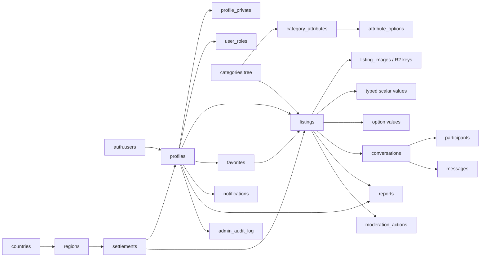

# Marketo v1.0 — production PostgreSQL/Supabase foundation

## Audit result

Marketo is a Next.js/Vinext modular monolith deployed as a Cloudflare Worker.
The application already has server-rendered routes and a single repository
boundary, but no connected production database. Drizzle existed only as an
empty SQLite/D1 starter; there were no applied, trustworthy migrations. The
active schema is now PostgreSQL, while runtime access uses Supabase's HTTP/Auth
clients rather than a direct Postgres connection from Cloudflare.

Existing user data was not fake-filled. Listing, profile, chat, notification
and moderation repositories return empty results. Temporary browser state is
limited to publish draft recovery, location preference and favorites. Categories
and geography are reference contracts, not user records.

### Route and boundary inventory

- Public/SEO routes: `/`, `/categories`, `/category/[slug]`, `/search`,
  `/listing/[slug]`, `/seller/[id]`, plus `robots.ts` and `sitemap.ts`.
- Account workflow: `/login`, `/profile`, `/profile/edit`, `/settings`,
  `/favorites`, `/notifications`.
- Marketplace workflow: `/publish`, `/messages`, `/messages/new`,
  `/messages/[id]`.
- Controlled operations: `/admin`, `/admin/[id]`.
- Resilience/help: `/offline`, `/help`, global loading/error/not-found.
- Existing API surface: `GET /api/listings`, which currently delegates to the
  same empty repository boundary and performs no write.

Pages are Server Components unless interaction requires a client boundary.
Client state is concentrated in category/location/filter selectors, publish,
Auth form, favorites, composer, moderation decision and PWA controls. No page
currently imports the elevated client. Existing PWA manifest/service worker,
SEO metadata, analytics hooks, routes and Cloudflare Worker entry point were
left intact.

The only previous SQL file was a single broad draft migration. It had no safe
application history and did not provide the required separation, typed values,
least-privilege grants or complete RLS. It was replaced—not applied remotely—by
the ordered 12-file sequence in `supabase/migrations/`. There were no existing
Supabase CLI migration records, database types, connected Supabase clients or
production credentials in the codebase.

## Domain topology

There are 23 exposed `public` tables. All 23 have RLS enabled. Internal helper
functions live in a non-exposed `private` schema. Binary media never enters
PostgreSQL: `listing_images.storage_key` and verified metadata point to an
object in Cloudflare R2.

## Table and relationship decisions

### Reference and profile data

- `locales`: RU/KK now; adding a locale is a reference insert, not a table
  redesign.
- `countries`: ISO-like code, localized names, currency code/symbol/exponent and
  phone prefix. KZT uses exponent 0.
- `regions`: belongs to a country (`RESTRICT`).
- `settlements`: one self-referencing KATO-compatible hierarchy for cities,
  towns, villages and district nodes. Separate city/village tables would make
  location FKs and search unnecessarily polymorphic. Parent links are
  `RESTRICT`, cycle-checked, and must remain within one region.
- `profiles.id`: the exact `auth.users.id`, `ON DELETE CASCADE`.
- `profile_private`: E.164 marketplace contact data, owner-only. Email and Auth
  phone/credentials remain in `auth.users`; no password is stored in `public`.
- `user_roles`: composite `(user_id, role)` key. No role/admin flag is writable
  through `profiles`.

`profiles` stores only `settlement_id`; country and region are derived through
joins. This avoids inconsistent country/region/city triples. Administrative
status is column-grant protected. Both anonymous and ordinary authenticated
cross-user reads are limited to seller-safe columns through the
`seller_profiles` security-invoker view. `get_my_profile()` returns protected
self fields; `get_profile_for_staff()` requires a moderator/admin role.

Current geography data is a bootstrap of 20 top-level administrative units and
90 major cities. It is not the complete Kazakhstan settlement register. The
target is a separately reviewed official KATO import with district and parent
settlement nodes, stable KATO codes, RU/KK names and `is_selectable` flags.

### Categories and attributes

- `categories.parent_id` implements unlimited depth with stable language-neutral
  slugs and a cycle-prevention trigger.
- RU/KK labels and presentation placeholders live on one category row.
- `category_attributes` supports text, number, boolean, select, multiselect,
  range and date plus required/filter/search flags and JSON validation metadata.
- `category_attribute_options` localizes stable option values.

The generated v1 seed stores the effective attribute set explicitly on every
category with `inherits_to_children=false`. This repeats small reference rows
but makes a category query deterministic and matches today's UI behavior.
Curated parent inheritance remains supported for future reference data without
forcing a complicated override system now.

The 228-node seed is the **initial Marketo reference taxonomy**. Automated
integrity checks prove that it currently has no duplicate slugs/sibling names,
orphans, cycles, localization gaps, inactive-parent violations or sibling sort
collisions, but business classification remains independently reviewable.

### Listings

- UUID primary key and a unique stable slug support SSR and current routes. A
  title edit does not have to rewrite the slug.
- `price_minor bigint` plus `currency_code` avoids formatted strings and remains
  valid for future currencies with non-zero exponents.
- Text statuses use check constraints rather than PostgreSQL enums, making
  future forward migrations safer: draft, pending, active, rejected, archived,
  sold, expired and deleted.
- Geography is normalized to `settlement_id`; region/country are derived.
- `deleted_at` exists only where recovery/moderation value justifies soft delete.
- Owner direct writes are restricted to draft/rejected editable columns.
  `submit_listing()` validates a leaf category, location, contact, image and
  required attributes, then moves only to `pending`. Approval is a separate
  moderator RPC. Owner archive/sold transitions are also controlled RPCs.
- `listing_contacts` is separated so public listing reads cannot leak phone
  numbers.
- `listing_attribute_values` uses typed scalar/range columns; selected options
  use a junction table. Triggers enforce category applicability, data type,
  active options and one value for single-select.
- `listing_images` stores R2 object key, ordering, dimensions, MIME and byte size.
  `sort_order=0` is the primary image. Authenticated browsers have no direct
  image-metadata write grant; a later server upload route must verify R2 first.
- Public RLS for scalar values, option values and images explicitly requires an
  active, published, non-deleted parent listing. Authenticated owners have a
  separate read path for all their listing states; scalar/option mutation is
  restricted to editable draft/rejected listings. Image metadata remains
  server-only even for the owner, preventing unverified R2 keys.

Owner deletion first archives listings, then nulls their owner FK. This preserves
moderation/history without leaving an active anonymous listing.

### Favorites, chat and notifications

- `favorites` has composite primary key `(user_id, listing_id)`; both FKs
  cascade because the relation has no value without either endpoint.
- One conversation is unique for `(listing, normalized participant pair)`.
  `get_or_create_listing_conversation()` is atomic and refuses an owner talking
  to themselves as a buyer. Duplicate/concurrent calls return one row.
- Participants are explicit; `last_read_at` is per participant rather than a
  message-level boolean. Messages preserve content after account deletion by
  setting sender to null, but cascade when a conversation is deleted.
- Authenticated clients may directly send text messages, never `system` or
  unverified image messages. A future server upload path may create image
  messages only after R2 verification.
- Notifications store `type + payload`, not hardcoded Russian text. UI
  dictionaries produce RU/KK text. Clients can read and mark only their own
  records and cannot create system notifications.
- Realtime publication is deliberately limited to `messages` and
  `notifications`.

### Reports, moderation and admin

- Reports retain targets/reporters with `SET NULL` so deletion cannot erase the
  record.
- Moderation decisions and report resolution run through role-checking,
  `SECURITY DEFINER` RPCs with `search_path=''`.
- Listing moderation uses a strict state machine: `pending→active` (approve),
  `pending→rejected` (reject), `active→archived` (hide), and
  `archived→active` (restore). Draft, rejected, sold, expired and deleted
  records cannot be revived through a moderation decision.
- `moderation_actions` records immutable listing decisions.
- `admin_audit_log` records actor, action, entity and non-secret JSON metadata.
- `assign_user_role()` is admin-only and audited. The frontend's `/admin` route
  alone grants no authority.

Reviews and saved searches were not added: current frontend contracts do not
implement them, so adding tables now would be speculative.

## ON DELETE summary

- `RESTRICT`: reference ownership and objects that must not silently disappear
  (country→region, region/parent→settlement, category parent, category and
  settlement on listings, attributes used by values/options).
- `CASCADE`: pure dependents with no standalone meaning (Auth→profile,
  profile-private, role rows, category→attribute→option, listing contact/value/
  image, favorites, conversation participants/messages, notifications).
- `SET NULL`: history that must survive deletion (listing owner after archive,
  message sender, conversation/listing/creator pair, reports, moderators and
  audit actors).

## RLS and grants

RLS and column grants work together; policies are intentionally operation-
specific and contain no blanket `USING (true)`/`WITH CHECK (true)` for private
data.

- Anonymous: active locales/countries/regions/settlements/categories and
  attributes; active published listings and their public values/images;
  seller-safe profile columns only.
- Authenticated: same public data and seller-safe cross-user profile columns;
  protected self profile through `get_my_profile()`; own private contact/favorites;
  participant conversations/messages; own notifications/reports; own drafts and
  editable aggregate rows.
- Owner: cannot update profile status/verification/roles; cannot self-approve a
  listing; cannot read another user's private contact, favorites, notifications
  or conversation.
- Moderator/admin: role-gated queue/report reads and controlled RPCs.
- Server/service secret: full database grants and RLS bypass; reserved for
  reviewed server-only system operations, imports and recovery—not ordinary UI
  requests.

All 14 elevated functions revoke default public execution and use an empty
`search_path`; the two trigger-only functions are not executable by the browser
role. The official Supabase guidance requires RLS on exposed tables,
explicit grants, and careful handling of security-definer functions:
[RLS documentation](https://supabase.com/docs/guides/database/postgres/row-level-security).

## Profile creation and Auth

The Auth trigger is idempotent and creates both public/private profile rows from
safe metadata after a new `auth.users` row. It accepts any active seeded locale,
so adding `en` later requires reference data rather than a profile-table change.
The reference seed must therefore be applied before enabling
signups. Supabase warns that a failing profile trigger can block registration,
which is why the isolated migration test covers it:
[user management guidance](https://supabase.com/docs/guides/auth/managing-user-data).

The current Marketo UI requests a Kazakhstan phone number, so v1 should connect
phone OTP first. Email/password and OAuth are not enabled speculatively. The
unused hosting-template `app/chatgpt-auth.ts` is not the marketplace security
boundary.

## Index and query strategy

- Reference lookups: country/region/parent plus active/sort indexes.
- RU/KK geo/category search: `pg_trgm` GIN indexes.
- Catalog: partial active indexes for category cursor, settlement cursor and
  category+settlement+price; generated `tsvector` GIN plus title trigram.
- Dynamic filters: `(attribute_id, number_value, listing_id)` and
  `(attribute_id, option_id, listing_id)`.
- User and moderation: owner/status/report queue indexes.
- Chat: participant, conversation message cursor and sender indexes.
- Notifications: user cursor and partial unread index.

Catalog pagination is keyset-based on `(published_at DESC, id DESC)`, avoiding
large offsets. The `catalog_listing_cards` security-invoker view joins one card
query and prevents N+1 for category/location/primary image. Detail queries use
one nested PostgREST select. Counts such as views/favorites are not client-
writable or prematurely denormalized.

PostgreSQL full text/trigram search is sufficient for v1. Elasticsearch, Redis,
Kafka and separate services are intentionally absent.

## Runtime data layer

- `lib/supabase/browser.ts`: publishable browser client.
- `lib/supabase/server.ts`: cookie-aware Auth client plus a sessionless,
  publishable-key server client for public reference reads.
- `lib/supabase/admin.ts`: server-only elevated factory; no current UI import.
- `lib/data/supabase/*`: domain queries/RPCs.
- `lib/reference-data/server.ts`: active reference orchestration, five-minute
  isolate cache and row-to-UI mapping.
- `components/reference-geography-provider.tsx`: read-only geography snapshot
  for the global header/city selector.
- `/api/reference/categories/:id/attributes`: public, RLS-protected lazy read of
  attributes/options for the selected category.
- `lib/supabase/database.types.ts`: generated-style interim contract using DB
  column names. Replace it with `supabase gen types typescript --linked` after a
  reviewed project link.
- `db/schema.ts`: Drizzle PostgreSQL table mirror and drift/export model.

Reference/catalog reads are now performed in Server Components or the narrow
attribute route. Client components receive serializable reference contracts and
render only the current selector level. Do not turn the whole app into a
client-side Supabase application.

## Environment and secret boundaries

Browser/build-safe:

- `NEXT_PUBLIC_SUPABASE_URL`
- `NEXT_PUBLIC_SUPABASE_PUBLISHABLE_KEY`
- legacy fallback only: `NEXT_PUBLIC_SUPABASE_ANON_KEY`

Server-only, only if an audited operation needs elevation:

- `SUPABASE_SECRET_KEY`
- legacy fallback: `SUPABASE_SERVICE_ROLE_KEY`

Migration tooling only: `DATABASE_URL`.

Use `.env.local` locally and Cloudflare secrets/variables separately for preview
and production. Never put a secret/service key in `NEXT_PUBLIC_*`, client code,
Git, logs or URLs. Current Supabase documentation recommends `sb_publishable_*`
and `sb_secret_*`; secret keys bypass RLS:
[API key guidance](https://supabase.com/docs/guides/getting-started/api-keys).

## Performance, abuse and future work

- Rate limiting is still required outside RLS for OTP, messages, reports,
  listing creation, phone reveal and abusive search.
- R2 upload authorization, MIME sniffing, size limits, orphan cleanup and image
  processing require a later server route.
- View/favorite counters need controlled functions or async aggregation; clients
  must never increment them directly.
- Full KATO settlements must be normalized and reviewed before import.
- Before any production application: run a Supabase branch test, Database
  Linter, Security Advisor, RLS scenario tests, query plans, backup/PITR check,
  and secret-bundle scan.
- Realtime publication follows Supabase's explicit-publication model:
  [Postgres Changes documentation](https://supabase.com/docs/guides/realtime/postgres-changes).

The reference integration performs SELECT only. No remote database mutation or
Cloudflare deployment is performed by its build/test workflow.
